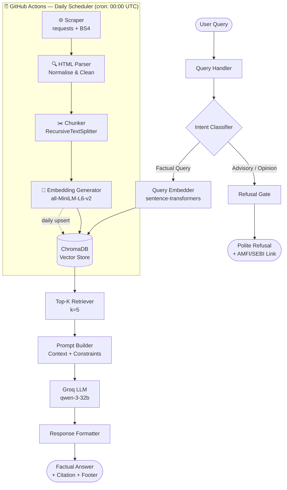
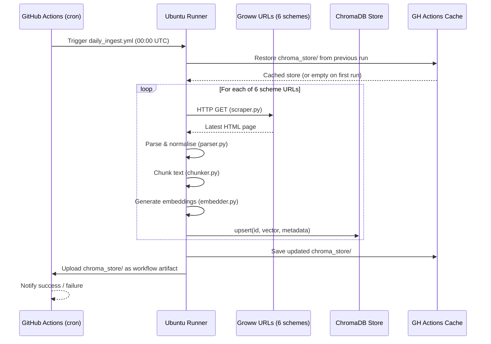
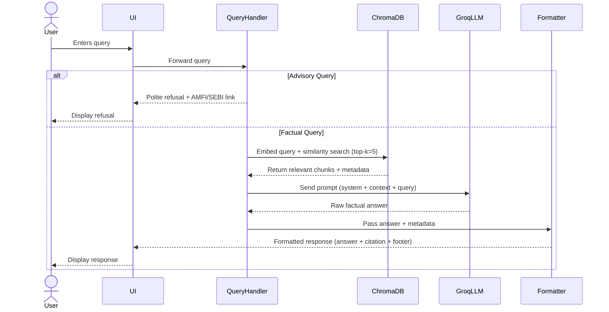

# Architecture: Mutual Fund FAQ Assistant (RAG-Based)

> **LLM:** Groq `qwen-3-32b` | **Vector DB:** ChromaDB | **Retrieval Strategy:** RAG (Retrieval-Augmented Generation) | **Data Refresh:** GitHub Actions Daily Scheduler

---

## 1. High-Level System Architecture

```
╔═════════════════════════════════════════════════════════════════════╗
║          GITHUB ACTIONS — DAILY SCHEDULER (00:00 UTC / 05:30 IST)  ║
╚══════════════════════════╤══════════════════════════════════════════╝
                           │  Triggers daily_ingest.yml workflow
                           ▼
┌─────────────────────────────────────────────────────────────────────┐
│                   INGESTION PIPELINE (Automated)                    │
│  ┌───────────┐  ┌──────────┐  ┌──────────┐  ┌────────────────────┐ │
│  │  Scraper  │─▶│  Parser  │─▶│  Chunker │─▶│ Embedding Generator│ │
│  │(Groww URLs│  │(Normalize│  │(500 tok, │  │ (all-MiniLM-L6-v2) │ │
│  │ requests) │  │ & clean) │  │ overlap) │  └────────┬───────────┘ │
│  └───────────┘  └──────────┘  └──────────┘           │             │
└──────────────────────────────────────────────────────┼─────────────┘
                                                        │ Upsert vectors
                                                        ▼
                              ┌─────────────────────────────────────┐
                              │   ChromaDB Vector Store             │
                              │   (collection: mf_faq_corpus)       │
                              └──────────────┬──────────────────────┘
                                             │
          ┌──────────────────────────────────┘
          │  Query-time retrieval
          ▼
┌─────────────────────────────────────────────────────────────────────┐
│                        USER INTERFACE (UI)                          │
│         Welcome Message | Example Questions | Disclaimer            │
└──────────────────────────────┬──────────────────────────────────────┘
                               │ User Query
                               ▼
┌─────────────────────────────────────────────────────────────────────┐
│                       QUERY HANDLER                                 │
│   ┌─────────────────────┐      ┌──────────────────────────────┐    │
│   │  Intent Classifier  │─────▶│  Advisory Query Refusal Gate  │   │
│   │  (Factual vs Advice)│      │  (Polite Refusal + AMFI Link) │   │
│   └─────────────────────┘      └──────────────────────────────┘    │
└──────────────────────────────┬──────────────────────────────────────┘
                               │ Factual Query Only
                               ▼
┌─────────────────────────────────────────────────────────────────────┐
│                      RAG PIPELINE                                   │
│                                                                     │
│   ┌──────────────────┐    ┌───────────────┐    ┌───────────────┐   │
│   │  Query Embedder  │───▶│  ChromaDB     │───▶│  Top-K Chunk  │   │
│   │  (Embedding API) │    │  Vector Store │    │  Retriever    │   │
│   └──────────────────┘    └───────────────┘    └──────┬────────┘   │
│                                                        │            │
│                                                        ▼            │
│                              ┌─────────────────────────────────┐   │
│                              │  Prompt Builder                  │   │
│                              │  (Context + Query + Constraints) │   │
│                              └───────────────┬─────────────────┘   │
└──────────────────────────────────────────────┼─────────────────────┘
                                               │
                                               ▼
┌─────────────────────────────────────────────────────────────────────┐
│                      GROQ LLM (qwen-3-32b)                         │
│           Generates ≤3-sentence factual answer                     │
└──────────────────────────────┬──────────────────────────────────────┘
                               │
                               ▼
┌─────────────────────────────────────────────────────────────────────┐
│                     RESPONSE FORMATTER                              │
│    Answer Text | Source Citation Link | Last Updated Date Footer    │
└──────────────────────────────┬──────────────────────────────────────┘
                               │
                               ▼
                        ← Response to User →
```

---

## 2. Architecture Diagram (Mermaid)



---

## 3. Component Breakdown

### 3.1 Data Ingestion Pipeline

Responsible for populating and **daily-refreshing** the ChromaDB vector store from the 6 official Groww scheme pages. The pipeline is fully automated via a GitHub Actions cron job that runs every day at **00:00 UTC (05:30 IST)**.

| Step | Component | Description |
|------|-----------|-------------|
| 1 | **Web Scraper** | Fetches latest HTML from all 6 Groww scheme URLs using `requests` + `BeautifulSoup` |
| 2 | **HTML Parser / Normaliser** | Extracts & cleans factual sections: expense ratio, exit load, NAV, riskometer, SIP details |
| 3 | **Text Chunker** | Splits extracted text using `RecursiveCharacterTextSplitter` (chunk size: 500, overlap: 50) |
| 4 | **Embedding Generator** | Converts chunks to dense vectors using `all-MiniLM-L6-v2` |
| 5 | **ChromaDB Upsert** | Upserts vectors + metadata into ChromaDB; existing docs with the same ID are replaced with fresh content |

> **Daily Refresh Strategy:** The ingestor uses `collection.upsert()` (not `add()`). Each chunk is keyed by a deterministic ID: `{scheme_slug}_{chunk_index}`. This ensures stale data is overwritten on every run without duplicating entries.

**Metadata stored per chunk:**

```json
{
  "source_url": "https://groww.in/mutual-funds/...",
  "scheme_name": "ICICI Prudential Large Cap Fund – Direct Growth",
  "amc": "ICICI Prudential",
  "category": "Large Cap",
  "ingested_at": "2026-08-27"   // updated on every daily run
}
```

---

### 3.2 Query Handler

Entry point for all user queries. Performs two critical tasks before RAG retrieval:

1. **Intent Classification**
   - Lightweight rule-based or LLM-assisted classifier
   - Labels query as `FACTUAL` or `ADVISORY`
   - Advisory keywords: *"should I", "which is better", "recommend", "opinion", "compare returns"*

2. **Refusal Gate**
   - Triggered for `ADVISORY` intent
   - Returns a polite, pre-defined refusal message
   - Appends an educational link (AMFI or SEBI)

---

### 3.3 RAG Pipeline

Core retrieval and generation logic.

```
User Query
    │
    ▼
Query Embedding (vector representation)
    │
    ▼
ChromaDB Similarity Search (cosine distance, top-k=5)
    │
    ▼
Retrieved Chunks (with metadata: source URL, scheme, date)
    │
    ▼
Prompt Construction (system prompt + context + user query)
    │
    ▼
Groq LLM Inference (qwen-3-32b, temperature=0.1)
    │
    ▼
Response (≤3 sentences + 1 citation + footer)
```

#### Prompt Template

```
System:
You are a facts-only mutual fund FAQ assistant. 
You answer only from the provided context. 
Do NOT provide investment advice, opinions, or comparisons. 
Keep your answer to a maximum of 3 sentences. 
Always end with: "Source: <url> | Last updated: <date>"

Context:
{retrieved_chunks}

User Question:
{user_query}

Answer:
```

---

### 3.4 ChromaDB Vector Store

| Property | Value |
|----------|-------|
| **Type** | Local persistent ChromaDB instance |
| **Collection** | `mf_faq_corpus` |
| **Distance Metric** | Cosine similarity |
| **Embedding Dimensions** | 384 (MiniLM) or 768 (larger models) |
| **Total Documents** | ~6 schemes × ~20–40 chunks = ~150–240 chunks |
| **Metadata Fields** | `source_url`, `scheme_name`, `amc`, `category`, `ingested_at` |

---

### 3.5 Groq LLM (qwen-3-32b)

| Property | Value |
|----------|-------|
| **Provider** | Groq Cloud API |
| **Model** | `qwen-3-32b` |
| **Temperature** | `0.1` (low, for factual consistency) |
| **Max Tokens** | `256` (enforces brevity) |
| **Top-P** | `0.9` |
| **Role** | Reads retrieved context, generates ≤3-sentence factual answer |

---

### 3.6 Response Formatter

Post-processes the LLM output before returning to the user:

- Validates that a source URL is present in the response
- Appends the **Last Updated** footer with the `ingested_at` date from chunk metadata
- Returns final structured response:

```
[Answer — max 3 sentences]

Source: https://groww.in/mutual-funds/...
Last updated from sources: 2026-08-27
```

---

### 3.7 User Interface (Minimal)

A lightweight web/CLI interface with the following elements:

| Element | Description |
|---------|-------------|
| **Welcome Banner** | App name, brief description |
| **Example Questions** | 3 pre-loaded factual query chips |
| **Query Input** | Text input for user questions |
| **Disclaimer** | *"Facts-only. No investment advice."* — always visible |
| **Response Area** | Displays answer, citation, and last-updated footer |
| **Refusal Message** | Shown for advisory queries, includes AMFI/SEBI link |

---

### 3.8 GitHub Actions Daily Scheduler

The ingestion pipeline is triggered automatically every day by a GitHub Actions workflow, keeping ChromaDB up-to-date without any manual intervention.

#### Workflow: `.github/workflows/daily_ingest.yml`

```yaml
name: Daily Corpus Refresh

on:
  schedule:
    - cron: "0 0 * * *"   # 00:00 UTC = 05:30 IST, every day
  workflow_dispatch:       # Allow manual trigger from GitHub UI

jobs:
  ingest:
    name: Scrape → Normalise → Chunk → Embed → Upsert
    runs-on: ubuntu-latest

    steps:
      - name: Checkout repository
        uses: actions/checkout@v4

      - name: Set up Python 3.11
        uses: actions/setup-python@v5
        with:
          python-version: "3.11"

      - name: Cache pip dependencies
        uses: actions/cache@v4
        with:
          path: ~/.cache/pip
          key: ${{ runner.os }}-pip-${{ hashFiles('requirements.txt') }}

      - name: Install dependencies
        run: pip install -r requirements.txt

      - name: Restore ChromaDB store from cache
        uses: actions/cache@v4
        with:
          path: chroma_store/
          key: chroma-store-${{ github.run_id }}
          restore-keys: chroma-store-

      - name: Run ingestion pipeline
        env:
          GROQ_API_KEY: ${{ secrets.GROQ_API_KEY }}
        run: python ingestion/ingest.py --mode daily

      - name: Upload ChromaDB store as artifact
        uses: actions/upload-artifact@v4
        with:
          name: chroma-store-${{ github.run_number }}
          path: chroma_store/
          retention-days: 7

      - name: Notify on failure
        if: failure()
        run: echo "::error::Daily ingestion failed — ChromaDB may be stale!"
```

#### Scheduler Flow



#### Key Scheduler Design Points

| Aspect | Detail |
|--------|--------|
| **Schedule** | `cron: "0 0 * * *"` — daily at 00:00 UTC (05:30 IST) |
| **Manual trigger** | `workflow_dispatch` allows on-demand re-ingestion from GitHub UI |
| **ChromaDB persistence** | Store is cached between runs using `actions/cache`; upserted in-place |
| **Upsert strategy** | Deterministic chunk IDs (`{scheme_slug}_{chunk_index}`) prevent duplicate vectors |
| **Secret management** | `GROQ_API_KEY` stored as a GitHub Actions Secret; never exposed in logs |
| **Failure alerting** | Step-level `if: failure()` emits a GitHub Actions error annotation |
| **Artifact retention** | `chroma_store/` uploaded as a versioned artifact, retained for 7 days for rollback |
| **Pip caching** | Dependency cache keyed on `requirements.txt` hash for fast runner startup |

---

## 4. Data Flow Sequence



---

## 5. Technology Stack

| Layer | Technology | Purpose |
|-------|-----------|---------|
| **LLM** | Groq API – `qwen-3-32b` | Factual answer generation |
| **Vector DB** | ChromaDB (local persistent) | Semantic similarity search |
| **Embeddings** | `sentence-transformers/all-MiniLM-L6-v2` | Text vectorisation |
| **Scraping** | `requests` + `BeautifulSoup4` | Fetch & parse Groww pages |
| **Text Splitting** | LangChain `RecursiveCharacterTextSplitter` | Chunk documents |
| **Orchestration** | Python (LangChain or custom) | Pipeline coordination |
| **UI** | Streamlit (or FastAPI + HTML) | Minimal web interface |
| **Scheduler** | GitHub Actions (`schedule: cron`) | Daily automated ingestion |
| **CI/CD Caching** | `actions/cache` | Persist ChromaDB between workflow runs |
| **Secret Storage** | GitHub Actions Secrets | Secure API key injection at runtime |
| **Config** | `.env` + `python-dotenv` | Local API key management |
| **Language** | Python 3.11+ | Core implementation |

---

## 6. Project Directory Structure

```
RAG-MF_FAQ/
├── .github/
│   └── workflows/
│       └── daily_ingest.yml      # ⏰ GitHub Actions cron — daily corpus refresh
│
├── docs/
│   ├── problemStatement.md       # Project requirements
│   └── architecture.md           # This document
│
├── data/
│   ├── raw/                      # Raw scraped HTML/text per scheme
│   └── processed/                # Chunked & normalised text (intermediate)
│
├── ingestion/
│   ├── scraper.py                # Fetches Groww pages (requests + BS4)
│   ├── parser.py                 # Normalises & extracts factual content
│   ├── chunker.py                # Splits text into chunks
│   ├── embedder.py               # Generates embeddings (all-MiniLM-L6-v2)
│   └── ingest.py                 # Orchestrates full pipeline; supports --mode daily
│
├── retrieval/
│   ├── query_embedder.py         # Query embedding utility
│   ├── retriever.py              # ChromaDB similarity search (top-k)
│   └── chroma_client.py          # ChromaDB connection & collection setup
│
├── pipeline/
│   ├── intent_classifier.py      # Factual vs. advisory detection
│   ├── prompt_builder.py         # Constructs LLM prompt from context
│   ├── llm_client.py             # Groq API wrapper
│   └── response_formatter.py     # Structures final response
│
├── ui/
│   └── app.py                    # Streamlit / FastAPI UI entry point
│
├── chroma_store/                 # Persisted ChromaDB vector store
│                                 # (cached by GitHub Actions between runs)
│
├── .env                          # GROQ_API_KEY (not committed to git)
├── .env.example                  # Template for environment variables
├── requirements.txt              # Python dependencies
└── README.md                     # Setup & usage guide
```

---

## 7. Corpus Coverage

| # | Scheme Name | AMC | Category | Groww URL |
|---|-------------|-----|----------|-----------|
| 1 | ICICI Prudential Large Cap Fund – Direct Growth | ICICI Prudential | Large Cap | [Link](https://groww.in/mutual-funds/icici-prudential-large-cap-fund-direct-growth) |
| 2 | ICICI Prudential Flexicap Fund – Direct Growth | ICICI Prudential | Flexi Cap | [Link](https://groww.in/mutual-funds/icici-prudential-flexicap-fund-direct-growth) |
| 3 | ICICI Prudential Multicap Fund – Direct Growth | ICICI Prudential | Multi Cap | [Link](https://groww.in/mutual-funds/icici-prudential-multicap-fund-direct-growth) |
| 4 | Nippon India Nifty 500 Momentum 50 Index Fund – Direct Growth | Nippon India | Index | [Link](https://groww.in/mutual-funds/nippon-india-nifty-500-momentum-50-index-fund-direct-growth) |
| 5 | Nippon India Large Cap Fund – Direct Growth | Nippon India | Large Cap | [Link](https://groww.in/mutual-funds/nippon-india-large-cap-fund-direct-growth) |
| 6 | Nippon India Tax Saver ELSS Fund – Direct Growth | Nippon India | ELSS | [Link](https://groww.in/mutual-funds/nippon-india-elss-tax-saver-fund-direct-growth) |

---

## 8. Key Design Decisions

| Decision | Rationale |
|----------|-----------|
| **RAG over fine-tuning** | Keeps responses grounded in live, official documents; avoids hallucination |
| **ChromaDB (local)** | Lightweight, no infrastructure needed; sufficient for ~200 chunks |
| **Low temperature (0.1)** | Maximises factual consistency; minimises creative drift |
| **≤3 sentence cap** | Enforces brevity; reduces risk of injecting unsupported claims |
| **Single citation per response** | Traceability; prevents confusion from multiple conflicting sources |
| **Rule-based intent classifier** | Fast, deterministic refusal without extra LLM call overhead |
| **Metadata-driven footer** | `ingested_at` from chunk metadata ensures accurate "last updated" date |
| **GitHub Actions cron scheduler** | Zero-infrastructure automation; daily scrape keeps corpus fresh without manual effort |
| **`upsert()` over `add()`** | Deterministic chunk IDs prevent vector duplication across daily runs |
| **`actions/cache` for ChromaDB** | Avoids full re-ingestion from scratch; only changed content is re-embedded |
| **`workflow_dispatch`** | Allows on-demand manual re-ingestion from the GitHub UI when needed |

---

## 9. Known Limitations

- **Daily staleness window:** Corpus is refreshed once daily; intra-day changes (e.g., NAV updates) are not reflected until the next run.
- **Scraping fragility:** Any structural change to Groww's HTML may break the parser; workflow failure alerts must be monitored.
- **GitHub Actions runner limits:** Free-tier GitHub Actions provides 2,000 minutes/month for private repos; the daily job should comfortably fit within limits (~2–5 min/run).
- **ChromaDB not cloud-hosted:** The store is cached in GitHub Actions artifacts, not a persistent cloud DB; deploying to a server requires an additional sync step.
- **No authentication layer:** The system is stateless and does not verify user identity.
- **English only:** No multilingual support.
- **No session memory:** Each query is independent; no conversational context is retained.
- **Groww-scoped data:** Only 6 schemes are covered; queries about other schemes will return "information not available."

---

## 10. Security & Compliance

| Concern | Mitigation |
|---------|-----------|
| **No PII collection** | UI collects only query text; no login, no personal data |
| **No advisory output** | Intent classifier + system prompt constraints prevent advisory responses |
| **API key security** | Groq API key stored in `.env`, excluded from version control via `.gitignore` |
| **Source integrity** | Only official Groww/AMC URLs are ingested; no third-party blogs |
| **Disclaimer visibility** | Permanent "Facts-only. No investment advice." banner in the UI |

---

*Architecture document for RAG-MF_FAQ | Last revised: 2026-08-27 | Daily ingestion via GitHub Actions added*
