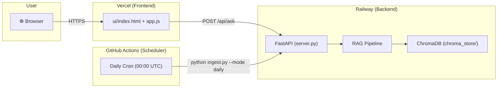

# Deployment Plan: Mutual Fund FAQ Assistant

> **Frontend:** Vercel | **Backend:** Railway | **Scheduler:** GitHub Actions  
> **Repository:** RAG-MF_FAQ | **Last Updated:** 2026-08-28

---

## Deployment Architecture



### Component Mapping

| Component | Platform | What It Runs | URL Pattern |
|-----------|----------|-------------|-------------|
| **Frontend** | Vercel | `ui/index.html` + `ui/static/app.js` (static site) | `https://<project>.vercel.app` |
| **Backend** | Railway | FastAPI (`ui/server.py`) — serves `/api/ask` endpoint | `https://<project>.up.railway.app` |
| **Scheduler** | GitHub Actions | `daily_ingest.yml` — daily ChromaDB corpus refresh | Runs inside Railway via API/CLI |

---

## Prerequisites

- [ ] GitHub repository pushed with all project code
- [ ] Accounts created on [Vercel](https://vercel.com), [Railway](https://railway.app)
- [ ] `GROQ_API_KEY` available
- [ ] Domain name (optional — both Vercel and Railway provide free subdomains)

---

## 1. Backend Deployment — Railway

Railway will host the FastAPI backend, the RAG pipeline, ChromaDB storage, and serve the `/api/ask` e### 1.1 — Project Preparation

#### Create `railpack.json` (Project Root)

Railway now uses the Railpack builder. We need to tell it how to start the FastAPI server:

```json
{
  "deploy": {
    "startCommand": "uvicorn ui.server:app --host 0.0.0.0 --port ${PORT:-8000}"
  }
}
```

#### Update `requirements.txt`

Ensure the following are present (they already are):

```
requests
beautifulsoup4
langchain
langchain-community
sentence-transformers
chromadb
groq
python-dotenv
fastapi
uvicorn[standard]
```

> [!IMPORTANT]
> Remove `streamlit` from `requirements.txt` for the Railway deployment if it's not needed — it adds unnecessary build time and memory usage.

#### Update `ui/server.py` — Add CORS Middleware and Endpoints

Since the frontend (Vercel) and backend (Railway) will be on different domains, CORS must be enabled. We also added a health check and an `/api/ingest/trigger` endpoint:

```python
import threading
from fastapi import Header, HTTPException
from fastapi.middleware.cors import CORSMiddleware

# After app = FastAPI()
app.add_middleware(
    CORSMiddleware,
    allow_origins=[
        "https://<your-project>.vercel.app",  # Production frontend
        "http://localhost:3000",                # Local dev
        "http://localhost:8000",                # Local dev
    ],
    allow_credentials=True,
    allow_methods=["*"],
    allow_headers=["*"],
)

# ... (health check and ask endpoints) ...

# --- Ingestion Trigger Endpoint ---
_ingest_running = False

@app.post("/api/ingest/trigger")
def trigger_ingest(authorization: str = Header(default=None)):
    # ... (auth logic) ...
    # Runs the ingestion pipeline inside the app process
    pass
```

> [!WARNING]
> Replace `<your-project>.vercel.app` with the actual Vercel deployment URL after the frontend is deployed. You can use `"*"` temporarily during setup but **must** restrict it for production.

### 1.2 — Railway Deployment Steps

1. **Login to Railway** → [railway.app](https://railway.app)
2. **New Project** → "Deploy from GitHub repo"
3. **Select repository:** `RAG-MF_FAQ`
4. **Configure environment variables** (Settings → Variables):

   | Variable | Value | Notes |
   |----------|-------|-------|
   | `GROQ_API_KEY` | `your_groq_api_key` | Required — LLM API key |
   | `CHROMA_PERSIST_DIR` | `./chroma_store` | ChromaDB storage path |
   | `COLLECTION_NAME` | `mf_faq_corpus` | ChromaDB collection name |
   | `EMBEDDING_MODEL` | `all-MiniLM-L6-v2` | Sentence-transformer model |
   | `TOP_K` | `5` | Number of retrieval results |
   | `FRONTEND_URL` | `https://<your-project>.vercel.app` | For CORS allowlist |
   | `INGEST_API_KEY` | (Optional) Random string | Protects the `/api/ingest/trigger` endpoint |

5. **Deploy** → Railway will build the Docker image, install dependencies, and start the server.

6. **Generate a public domain:**
   - Settings → Networking → "Generate Domain"
   - Note the URL: `https://<project>.up.railway.app`

### 1.3 — Initial Data Seeding on Railway

After the first deployment, ChromaDB will be empty. Run the ingestion pipeline once via the new endpoint:

```bash
curl -X POST https://<project>.up.railway.app/api/ingest/trigger -H "Authorization: Bearer <your_INGEST_API_KEY>"
```

> [!IMPORTANT]
> The first ingestion must complete before the `/api/ask` endpoint will return meaningful results. This may take 2–5 minutes. Check Railway logs for progress.

### 1.4 — Persistent Storage (ChromaDB)

Railway containers are ephemeral by default. To persist `chroma_store/` across deploys:

1. **Add a Volume** in Railway:
   - Settings → Volumes → "Add Volume"
   - **Mount Path:** `/app/chroma_store`
   - This maps to `./chroma_store` inside the container

2. **Update `CHROMA_PERSIST_DIR`** environment variable if necessary to match the mount path.

> [!CAUTION]
> Without a persistent volume, every redeployment will wipe the ChromaDB data and require a fresh ingestion run. This is critical for production reliability.

### 1.5 — Verification

- [ ] `https://<project>.up.railway.app/` returns the HTML page (or a JSON response)
- [ ] `POST https://<project>.up.railway.app/api/ask` with body `{"query": "What is the expense ratio of ICICI Large Cap?"}` returns a valid JSON response
- [ ] Railway logs show no errors during startup
- [ ] ChromaDB volume is mounted and persists across redeploys

---

## 2. Frontend Deployment — Vercel

Vercel will serve the static frontend (`index.html` + `app.js`) and proxy API requests to the Railway backend.

### 2.1 — Project Restructuring for Vercel

Vercel needs a clear static site or framework structure. Since the frontend is plain HTML + JS, we'll deploy it as a static site with API rewrites.

#### Create `vercel.json` (Project Root)

```json
{
  "version": 2,
  "framework": null,
  "buildCommand": "",
  "installCommand": "",
  "outputDirectory": "ui",
  "rewrites": [
    {
      "source": "/api/:path*",
      "destination": "https://<project>.up.railway.app/api/:path*"
    }
  ],
  "headers": [
    {
      "source": "/(.*)",
      "headers": [
        { "key": "X-Content-Type-Options", "value": "nosniff" },
        { "key": "X-Frame-Options", "value": "DENY" },
        { "key": "X-XSS-Protection", "value": "1; mode=block" }
      ]
    }
  ]
}
```

> [!IMPORTANT]
> The `"framework": null` line is crucial to prevent Vercel from trying to deploy this as a FastAPI Python backend. Replace `<project>.up.railway.app` with your actual Railway deployment URL.

#### Create `.vercelignore` (Project Root)

Tell Vercel to ignore backend files:

```
# Backend & pipeline
ui/server.py
pipeline/
retrieval/
ingestion/
chroma_store/
data/
tests/

# Config & environment
.env
.env.example
.venv/
__pycache__/
*.pyc

# Railway config
railpack.json
requirements.txt
```

#### Update API Base URL in `ui/static/app.js`

The frontend JS currently calls `/api/ask` (relative path). With Vercel rewrites, this will automatically proxy to Railway, so **no code change is needed** — the relative `/api/ask` path will work via the rewrite rule.

### 2.2 — Vercel Deployment Steps

1. **Login to Vercel** → [vercel.com](https://vercel.com)
2. **Import Project** → "Add New Project" → Select `RAG-MF_FAQ` from GitHub
3. **Framework Preset:** Select **"Other"** (since this is a static HTML site)
4. **Root Directory:** Leave as `/` (project root)
5. **Build & Output Settings:**
   - Build Command: *leave empty*
   - Output Directory: `ui`
   - Install Command: *leave empty*
6. **Environment Variables:** **Leave completely empty.** Vercel does not need any backend environment variables for this static site.
7. **Deploy** → Vercel will deploy the static files from `ui/`.
8. **Note the deployment URL:** `https://<project>.vercel.app`

### 2.3 — Post-Deploy: Update CORS on Railway

After obtaining the Vercel URL, go back to Railway and:

1. Update the `FRONTEND_URL` environment variable to the actual Vercel URL
2. Update the CORS `allow_origins` list in `server.py` (or read from `FRONTEND_URL` env var):

```python
import os

FRONTEND_URL = os.getenv("FRONTEND_URL", "http://localhost:3000")

app.add_middleware(
    CORSMiddleware,
    allow_origins=[
        FRONTEND_URL,
        "http://localhost:3000",
        "http://localhost:8000",
    ],
    allow_credentials=True,
    allow_methods=["*"],
    allow_headers=["*"],
)
```

### 2.4 — Verification

- [ ] `https://<project>.vercel.app` loads the Mutual Fund FAQ Assistant UI
- [ ] Welcome state renders correctly (avatar, headline, 3 bento cards)
- [ ] Clicking an example card submits a query and receives a response from Railway backend
- [ ] Advisory queries return the refusal bubble
- [ ] Disclaimer banner is visible
- [ ] Mobile responsive layout works
- [ ] No CORS errors in browser console

---

## 3. Scheduler — GitHub Actions

The existing `daily_ingest.yml` workflow handles automated daily corpus refresh. It needs to be updated to trigger ingestion on the Railway-hosted backend instead of running locally.

### 3.1 — Updated Workflow Strategy

Since ChromaDB lives on Railway (with persistent volume), the GitHub Actions scheduler must trigger ingestion **on the Railway service**.

#### Option A: Railway CLI in GitHub Actions (Recommended)

Update `.github/workflows/daily_ingest.yml`:

```yaml
name: Daily Corpus Refresh

on:
  schedule:
    - cron: "0 0 * * *"     # 00:00 UTC = 05:30 IST daily
  workflow_dispatch:          # Manual trigger from GitHub UI

jobs:
  ingest:
    runs-on: ubuntu-latest
    steps:
      - uses: actions/checkout@v4

      - uses: actions/setup-python@v5
        with:
          python-version: "3.11"

      - uses: actions/cache@v4
        with:
          path: ~/.cache/pip
          key: ${{ runner.os }}-pip-${{ hashFiles('requirements.txt') }}

      - run: pip install -r requirements.txt

      - name: Run daily ingestion
        run: python ingestion/ingest.py --mode daily
        env:
          GROQ_API_KEY: ${{ secrets.GROQ_API_KEY }}
          CHROMA_PERSIST_DIR: ./chroma_store

      - name: Upload ChromaDB artifact
        uses: actions/upload-artifact@v4
        if: success()
        with:
          name: chroma-store-${{ github.run_number }}
          path: chroma_store/
          retention-days: 7

      - name: Report failure
        if: failure()
        run: echo "::error::Daily ingestion failed — ChromaDB may be stale!"
```

#### Option B: Trigger Railway Redeploy with Fresh Data via API

If you want the ingestion to run directly on Railway (so the data persists in Railway's volume), create a dedicated ingestion endpoint:

```yaml
name: Daily Corpus Refresh

on:
  schedule:
    - cron: "0 0 * * *"
  workflow_dispatch:

jobs:
  trigger-ingest:
    runs-on: ubuntu-latest
    steps:
      - name: Trigger ingestion on Railway
        run: |
          curl -X POST \
            -H "Authorization: Bearer ${{ secrets.INGEST_API_KEY }}" \
            -H "Content-Type: application/json" \
            https://<project>.up.railway.app/api/ingest/trigger
        timeout-minutes: 10

      - name: Report failure
        if: failure()
        run: echo "::error::Daily ingestion failed — ChromaDB may be stale!"
```

> [!NOTE]
> **Option A** runs ingestion inside GitHub Actions and uploads the ChromaDB store as an artifact (backup). The Railway instance would need to sync this data.  
> **Option B** triggers ingestion directly on Railway where ChromaDB lives — simpler for data persistence but requires adding a protected `/api/ingest/trigger` endpoint to `server.py`.

### 3.2 — GitHub Repository Secrets

Configure the following secrets in the GitHub repository:  
`Settings → Secrets and variables → Actions → New repository secret`

| Secret Name | Value | Purpose |
|-------------|-------|---------|
| `GROQ_API_KEY` | Your Groq API key | Used by the ingestion script for LLM-assisted parsing |
| `RAILWAY_TOKEN` | Railway API token (if using Option B) | Authenticate Railway CLI / API calls |
| `INGEST_API_KEY` | A strong random token (if using Option B) | Protect the `/api/ingest/trigger` endpoint |

### 3.3 — Monitoring & Alerts

- **GitHub Actions** automatically sends email notifications on workflow failures to the repository owner
- **Workflow status badge** — add to `README.md`:
  ```markdown
  
  ```
- **Railway logs** — monitor via Railway Dashboard → Deployments → Logs
- **Vercel logs** — monitor via Vercel Dashboard → Deployments → Functions

### 3.4 — Verification

- [ ] Workflow appears under the GitHub Actions tab
- [ ] `workflow_dispatch` (manual trigger) runs successfully
- [ ] Cron schedule triggers at 00:00 UTC daily
- [ ] `GROQ_API_KEY` is **not** visible in any log output
- [ ] Failure notification email is received on simulated failure
- [ ] ChromaDB artifact is uploaded on success (Option A)

---

## 4. Environment Variables — Master Reference

### Railway (Backend)

| Variable | Value | Required |
|----------|-------|----------|
| `GROQ_API_KEY` | `gsk_...` | ✅ |
| `CHROMA_PERSIST_DIR` | `./chroma_store` | ✅ |
| `COLLECTION_NAME` | `mf_faq_corpus` | ✅ |
| `EMBEDDING_MODEL` | `all-MiniLM-L6-v2` | ✅ |
| `TOP_K` | `5` | ✅ |
| `FRONTEND_URL` | `https://<project>.vercel.app` | ✅ (for CORS) |
| `PORT` | Auto-injected by Railway | Auto |

### GitHub Actions (Scheduler)

| Secret | Value | Required |
|--------|-------|----------|
| `GROQ_API_KEY` | `gsk_...` | ✅ |
| `RAILWAY_TOKEN` | Railway API token | Only for Option B |
| `INGEST_API_KEY` | Random bearer token | Only for Option B |

### Vercel (Frontend)

| Variable | Value | Required |
|----------|-------|----------|
| None required — static site with API rewrites | — | — |

---

## 5. Deployment Order & Checklist

Follow this exact order to avoid circular dependency issues (CORS, URLs):

### Step 1: Deploy Backend to Railway
- [ ] Create `Procfile`, `runtime.txt`, `railway.toml`
- [ ] Add CORS middleware to `server.py`
- [ ] Push to GitHub
- [ ] Create Railway project from GitHub repo
- [ ] Set all environment variables
- [ ] Deploy and generate public domain
- [ ] Note the Railway URL: `https://__________.up.railway.app`
- [ ] Run initial data ingestion (`railway run python ingestion/ingest.py --mode daily`)
- [ ] Verify `/api/ask` endpoint responds correctly

### Step 2: Deploy Frontend to Vercel
- [ ] Create `vercel.json` with API rewrite pointing to Railway URL
- [ ] Push to GitHub
- [ ] Import project into Vercel
- [ ] Configure as static site with output directory `ui`
- [ ] Deploy
- [ ] Note the Vercel URL: `https://__________.vercel.app`
- [ ] Verify UI loads and API calls work

### Step 3: Update CORS on Railway
- [ ] Set `FRONTEND_URL` env var on Railway to the Vercel URL
- [ ] Redeploy Railway service
- [ ] Verify no CORS errors from the Vercel frontend

### Step 4: Configure GitHub Actions Scheduler
- [ ] Add `GROQ_API_KEY` to GitHub repository secrets
- [ ] Update `daily_ingest.yml` if needed
- [ ] Run `workflow_dispatch` manually to verify
- [ ] Confirm cron schedule is active

### Step 5: End-to-End Verification
- [ ] Open `https://<project>.vercel.app` in browser
- [ ] Submit a factual query → verify answer with source citation
- [ ] Submit an advisory query → verify polite refusal
- [ ] Check browser console for any errors
- [ ] Verify mobile responsive layout
- [ ] Confirm disclaimer banner is always visible
- [ ] Check Railway logs for request handling
- [ ] Trigger GitHub Actions workflow manually → confirm success

---

## 6. Cost Estimation

| Service | Plan | Expected Cost | Notes |
|---------|------|--------------|-------|
| **Vercel** | Hobby (Free) | $0/month | Static site — well within free tier limits |
| **Railway** | Starter | ~$5–10/month | Depends on RAM/CPU usage; `sentence-transformers` model loading requires ~512MB RAM |
| **GitHub Actions** | Free tier | $0/month | 2,000 min/month; daily ingest takes ~2–5 min = ~60–150 min/month |
| **Groq API** | Free tier | $0/month | Free tier allows ~14,400 requests/day on Qwen models |

> [!TIP]
> Railway's Starter plan includes $5 of free credits/month. Monitor usage in the Railway dashboard under "Usage" to stay within budget. The primary cost driver will be the `sentence-transformers` model loading at server startup (~512MB RAM).

---

## 7. Rollback Plan

| Scenario | Action |
|----------|--------|
| **Bad frontend deploy** | Vercel → Deployments → select previous deployment → "Promote to Production" |
| **Bad backend deploy** | Railway → Deployments → select previous deployment → "Rollback" |
| **Corrupted ChromaDB** | Download the latest `chroma-store-*` artifact from GitHub Actions → restore to Railway volume |
| **Ingestion failure** | Check GitHub Actions logs → fix the issue → re-run `workflow_dispatch` manually |
| **API key compromised** | Rotate `GROQ_API_KEY` in Railway env vars + GitHub Secrets immediately |

---

## 8. Production Hardening Checklist

- [ ] **CORS** — restrict `allow_origins` to only the Vercel domain (no wildcards)
- [ ] **Rate limiting** — add rate limiting middleware to FastAPI (e.g., `slowapi`)
- [ ] **HTTPS** — both Vercel and Railway provide HTTPS by default ✅
- [ ] **Secrets** — no API keys in code or logs; all in env vars / secrets
- [ ] **Health check** — Railway health check configured at `/`
- [ ] **Error handling** — all exceptions caught and return user-friendly JSON errors
- [ ] **Logging** — structured logging enabled in `server.py`
- [ ] **Volume backup** — ChromaDB artifacts uploaded to GitHub Actions on each successful ingest
- [ ] **Custom domain** (optional) — configure in Vercel/Railway settings if needed

---

*Deployment Plan for RAG-MF_FAQ | Created: 2026-08-28 | Platforms: Vercel + Railway + GitHub Actions*
